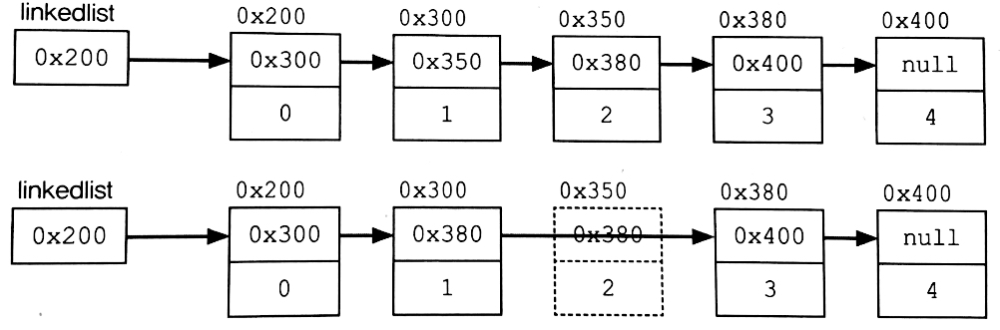

# **1. LinkedList**
## **LinkedList란?**
&nbsp; 배열은 가장 기본적인 형태의 자료구조로, 구조가 간단하며 데이터 탐색 시간이 가장 빠르지만 큰 단점을 가지고 있다. 먼저 **크기를 변경할 수  없다**. 배열은 크기를 변경하기 위해 새로운 배열을 생성해 데이터를 복사헤야 한다는 단점이 있다. 또 비순차적인 데이터 삽입, 삭제에 시간이 많이 소요된다.  

&nbsp; 이러한 배열의 단점을 보완하기 위해 LinkedList가 고안되었다. 배열과 다르게 LinkedList는 불연속적으로 존재하는 데이터를 서로 연결(link)한 형태로 구성돼 있다. LinkedList의 각 node들은 자신과 연결된 다음 요소에 대한 주소와 데이터로 구성돼 있다.  

<p align=center>
	
</p>
&nbsp; 위의 그림은 LinkedList의 중간에 있는 node를 삭제하는 과정이다. 삭제하고자 하는 요소의 이전요소가 삭제하고자 하는 요소의 다음 요소를 참조하도록 변경하기만 하면 된다. 추가 등의 다른 과정도 이렇게 이루어지기 때문에 배열보다 오버헤드가 적다.  

</br>  
&nbsp; 이렇게 단방향으로 있는 LinkedList와 다르게 각 노드들이 가리키는 방향이 nest와 previous, 양방향인 LinkedList도 있다. 이를 **Double LinkedList**라고 한다. 당연히 단방향일 때보다 노드 간 접근 및 이동이 쉽다. 실제로 Java의 LinkedList 클래스도 Double LinkedList로 구현돼 있다. 이보다 더 접근성을 향상한 **Doubly Circular LinkedList**도 있지만 구현이 복잡해 보통 Double LinkedList를 사용한다. (마지막 요소가 첫번째 요소를 가리키는 구조를 원형이라고 한다.)

## **Method**
<table style="border-collapse: collapse; width: 100%; height: 450px;" border="1" data-ke-align="alignLeft" data-ke-style="style12">
<tbody>
<tr style="height: 18px;">
<td style="width: 50%; height: 18px;">LinkedList()</td>
<td style="width: 50%; height: 18px;">LinkedList 생성자</td>
</tr>
<tr style="height: 18px;">
<td style="width: 50%; height: 18px;">LinkedList(Collection c)</td>
<td style="width: 50%; height: 18px;">주어진 컬렉션을 포함하는 LinkedList 생성자</td>
</tr>
<tr style="height: 18px;">
<td style="width: 50%; height: 18px;">boolean add(Object o)</td>
<td style="width: 50%; height: 18px;">지정된 객체 o를 LinkedList 끝에 삽입</td>
</tr>
<tr style="height: 18px;">
<td style="width: 50%; height: 18px;">void add(int index, Object element)</td>
<td style="width: 50%; height: 18px;">지정된 위치(index)에 객체를 추가</td>
</tr>
<tr style="height: 18px;">
<td style="width: 50%; height: 18px;">boolean addAll(Collection c)</td>
<td style="width: 50%; height: 18px;">주어진 컬렉션에 포함된 모든 요소를 LinkedList의 끝에 추가</td>
</tr>
<tr style="height: 18px;">
<td style="width: 50%; height: 18px;">void clear()</td>
<td style="width: 50%; height: 18px;">LinkedList의 모든 요소를 삭제</td>
</tr>
<tr style="height: 18px;">
<td style="width: 50%; height: 18px;">boolean contains(Object o)</td>
<td style="width: 50%; height: 18px;">지정된 객체가 LinkedList에 포함됐는지 여부</td>
</tr>
<tr style="height: 18px;">
<td style="width: 50%; height: 18px;">boolean containsAll(Collection c)</td>
<td style="width: 50%; height: 18px;">지정된 컬렉션이 LinkedList에 포함됐는지 여부</td>
</tr>
<tr style="height: 18px;">
<td style="width: 50%; height: 18px;">Object get(int index)</td>
<td style="width: 50%; height: 18px;">지정된 위치(index)의 객체 반환</td>
</tr>
<tr style="height: 18px;">
<td style="width: 50%; height: 18px;">int indexOf(Object o)</td>
<td style="width: 50%; height: 18px;">지정된 객체가 저장된 인덱스 반환</td>
</tr>
<tr style="height: 18px;">
<td style="width: 50%; height: 18px;">boolean isEmpty()</td>
<td style="width: 50%; height: 18px;">LinkedList가 비어있는지 리턴</td>
</tr>
<tr style="height: 18px;">
<td style="width: 50%; height: 18px;">int lastIndexOf(Object o)</td>
<td style="width: 50%; height: 18px;">지정된 객체의 index 반환 (역순 검색)</td>
</tr>
<tr style="height: 18px;">
<td style="width: 50%; height: 18px;">Object remove(int index)</td>
<td style="width: 50%; height: 18px;">지정된 index의 객체 삭제</td>
</tr>
<tr style="height: 18px;">
<td style="width: 50%; height: 18px;">boolean remove(Object o)</td>
<td style="width: 50%; height: 18px;">지정된 객체를 LinkedList에서 제거</td>
</tr>
<tr style="height: 18px;">
<td style="width: 50%; height: 18px;">boolean removeAll(Collection c)</td>
<td style="width: 50%; height: 18px;">지정된 컬렉션의 요소와 일치하는 요소를 모두 삭제</td>
</tr>
<tr style="height: 18px;">
<td style="width: 50%; height: 18px;">boolean retainAll(Collection c)</td>
<td style="width: 50%; height: 18px;">지정된 컬렉션의 모든 요소가 포함되어 있는지 확인</td>
</tr>
<tr style="height: 18px;">
<td style="width: 50%; height: 18px;">Object set(int index, Object element)</td>
<td style="width: 50%; height: 18px;">지정된 위치의 객체를 주어진 객체로 바꿈</td>
</tr>
</tbody>
</table>

## **⭐️ LinkedList와 ArrayList의 차이**
### 1. 순차적으로 삽입/삭제하는 경우, ArrayList가 효율적
&nbsp; 초기용량을 고려하지 않고 봤을 때, 순차적인 작업은 ArrayList가 효율적이다. 순차적으로 삭제한다는 것은 마지막 데이터부터 역순으로 삭제해나간다는 것을 의미한다. ArrayList는 마지막 데이터부터 삭제할 경우 각 요소들의 재배치가 필요하지 않으므로 상당히 빠르다. 마지막 요소를 null로 바꿔주면 되기 때문이다.  

### 2. 중간 데이터를 삽입/삭제하는 경우, LinkedList가 효율적
중간 요소를 추가 또는 삭제하는 경우 LinkedList는 각 요소간의 연결만 변경해주면 되지만, ArrayList는 각요소들을 재배치하여 추가할 공간을 확보 또는 빈 공간을 채워야하기 때문에 처리속도가 느리다.

### 3. 정리
|Collection|접근시간(읽기)|삽입 / 삭제|설명|
|----------|-----------|--------|---|
|ArrayList|빠르다|느리다|✓ 순차적인 삽입삭제는 더 빠름 </br> ✓ 비효율적인 메모리 사용|
|LinkedList|느리다|빠르다|✓ 데이터가 많을수록 접근성이 떨어짐|

# **2. Stack**
## **Stack이란?**
&nbsp; Stack은 자료구조(Data Structure) 중 하나로, 마지막에 저장된 데이터를 가장 먼저 꺼내는 <b>LIFO</b>(: Lask In First Out) 구조이다.

<p align="center"></p>

&nbsp; 위의 그림처럼 0, 1, 2를 순차적으로 삽입하면 추출할 때는 2, 1, 0 순서로 추출된다. 이렇게 순차적으로 추가 및 삭제되므로, 구현 시에 Collection 클래스 중 ArrayList와 같은 배열 기반의 Collection 클래스로 구현하는 것이 적합하다. 반대로 Queue는 (Queue에 대해 다룰 때 다시 설명하겠지만,) 배열 기반의 Collection 클래스로 구현할 경우 빈 공간을 채우기 위한 복사가 많이 일어나므로 비효율적이다.

## **Method**
<table style="border-collapse: collapse; width: 100%; height: 113px;" border="1" data-ke-align="alignLeft" data-ke-style="style12">
<tbody>
<tr style="height: 23px;">
<td style="width: 27.093023255813954%; text-align: center; height: 23px;"><b>Method</b></td>
<td style="width: 72.90697674418604%; text-align: center; height: 23px;"><b>Explanation</b></td>
</tr>
<tr style="height: 18px;">
<td style="width: 27.093023255813954%; height: 18px;">boolean empty( )</td>
<td style="width: 72.90697674418604%; height: 18px;">Stack이 비어있는지 알려주는 메서드</td>
</tr>
<tr style="height: 18px;">
<td style="width: 27.093023255813954%; height: 18px;">Object peek( )</td>
<td style="width: 72.90697674418604%; height: 18px;">Stack 맨 위에 저장된 객체 반환</td>
</tr>
<tr style="height: 18px;">
<td style="width: 27.093023255813954%; height: 18px;">Object pop( )</td>
<td style="width: 72.90697674418604%; height: 18px;">Stack 맨 위에 저장된 객체 추출</td>
</tr>
<tr style="height: 18px;">
<td style="width: 27.093023255813954%; height: 18px;">Object push(Object o)</td>
<td style="width: 72.90697674418604%; height: 18px;">Stack에 객체 o 삽입</td>
</tr>
<tr style="height: 18px;">
<td style="width: 27.093023255813954%; height: 18px;">int search(Object o)</td>
<td style="width: 72.90697674418604%; height: 18px;">Stack에서 객체 o를 찾아 인덱스 반환 (인덱스는 1부터 시작됨)</td>
</tr>
</tbody>
</table>

## **Stack의 활용**
&nbsp; Stack이나 Queue를 막상 어디에 써야할까에 대해 잘 떠오르지 않을 수 있다. 하지만 생각보다 우리의 생활에 빈번히 사용되고 있다.  
➡️ 수식 계산, 수식 괄호 검사, 워드 프로세서의 Undo/Redo, 웹 브라우저의 뒤로가기/앞으로가기

## **Stack 구현하기**
&nbsp; 위의 설명에서 Stack은 ArrayList와 같은 배열 기반 Collection 클래스로 구현하는 것이 좋다고 하였다. 그럼 이제 Stack을 직접 구현해보자. (책이나 다른 블로그를 보면 상속을 통해 구현하는 경우가 있는데, 필자는 클래스 안에서 ArrayList를 생성해 구현해보겠다.)

### **i) Node 클래스**
```java
public class Node {
 	int index;
 	int value;
 	
 	Node(int index, int value) {
 		this.index = index;
 		this.value = value;
 	}
 	
 	int getValue() {
 		return value;
 	}
}
```  
&nbsp; 먼저 Node 클래스를 하나 생성해주자. 값과 인덱스를 저장해놓으면 된다. 여기서 의문점이 생긴다. "사용자가 지정하는 제네릭에 따라 타입이 바뀌지 않나요?" 이 부분은 건너뛰고, 이번 구현에서는 정수값만을 취급하는 Node를 통해 기본적인 구조에 대해 알고, 구현하는 방법에 대해서만 따져보도록 하자.

### **ii) Stack 클래스**
```java
import java.util.ArrayList;
import java.util.EmptyStackException;

public class Stack {
 	ArrayList dataStructure;
 	static int index = 1;
 	static int size = 0;
 	
 	Stack(){
 		dataStructure = new ArrayList();
 	}
 	
 	boolean empty() {
 		if(dataStructure.size() == 0)  { return true; }
 		else  { return false; }
 	}	// empty
 	
 	int size() {
 		return dataStructure.size();
 	}
 	
 	void push(int i) {
 		Node node = new Node(index++, i);
 		dataStructure.add(node);
 		size++;
 	}	// push
 	
 	int peek() {
 		try {
 			Node lastInNode = dataStructure.get(size-1);
 			return lastInNode.getValue();
 		}catch(IndexOutOfBoundsException e) {
 			throw new EmptyStackException();
 		}
 	}	// peek
 	
 	int pop() {
 		try {
 			Node lastInNode = dataStructure.get(size-1);
 			dataStructure.remove(size-1);
 			size--;
 			return lastInNode.getValue();
 		}catch(IndexOutOfBoundsException e) {
 			throw new EmptyStackException();
 		}
 	}	// pop
}
```  
&nbsp; 다음과 같이 간단하게 Stack을 구현해주었다. Main 클래스를 통해 테스트 해보면 잘 작동되는 것을 확인할 수 있다.


# **3. Queue**
## **Queue란?**
&nbsp; Queue은 자료구조(Data Structure) 중 하나로, 처음에 저장된 데이터를 가장 먼저 꺼내는 **FIFO**(: First In First Out) 구조이다.  

<p align="center"></p>


&nbsp; Stack과 반대로 Queue는 순서의 변경 없이 먼저 넣은 것을 먼저 꺼낸다. 이와 같이 Queue는 데이터를 꺼낼 때 항상 첫 번째 저장된 데이터를 삭제하므로, ArrayList와 같은 배열 기반의 Collection 클래스를 사용한다면 데이터를 꺼낼 때마다 빈 공간을 채우기 위해 데이터의 복사가 발생하므로 비효율적이다. 따라서 Queue는 데이터의 추가/삭제가 용이한 LinkedList로 구현하는 것이 더 적합하다.  

## **Method**
<table style="border-collapse: collapse; width: 100%; height: 113px;" border="1" data-ke-align="alignLeft" data-ke-style="style12">
    <tbody>
        <tr style="height: 23px;">
            <td style="width: 27.093023255813954%; text-align: center; height: 23px;"><b>Method</b></td>
            <td style="width: 72.90697674418604%; text-align: center; height: 23px;"><b>Explanation</b></td>
        </tr>
        <tr style="height: 18px;">
            <td style="width: 27.093023255813954%; height: 18px;">boolean add(Object o)</td>
            <td style="width: 72.90697674418604%; height: 18px;">Queue에 객체 o 삽입</td>
        </tr>
        <tr style="height: 18px;">
            <td style="width: 27.093023255813954%; height: 18px;">Object remove( )</td>
            <td style="width: 72.90697674418604%; height: 18px;">Queue에서 객체를 추출</td>
        </tr>
        <tr style="height: 18px;">
            <td style="width: 27.093023255813954%; height: 18px;">Object element( )</td>
            <td style="width: 72.90697674418604%; height: 18px;">Queue에서 객체를 반환</td>
        </tr>
        <tr style="height: 18px;">
            <td style="width: 27.093023255813954%; height: 18px;">boolean offer(Object o)</td>
            <td style="width: 72.90697674418604%; height: 18px;">Queue에 객체 o를 저장</td>
        </tr>
        <tr style="height: 18px;">
            <td style="width: 27.093023255813954%; height: 18px;">Object poll( )</td>
            <td style="width: 72.90697674418604%; height: 18px;">Queue에서 객체를 추출</td>
        </tr>
        <tr>
            <td style="width: 27.093023255813954%;">Object peek( )</td>
            <td style="width: 72.90697674418604%;">Queue에서 객체를 반환</td>
        </tr>
    </tbody>
</table>

&nbsp; 삽입을 할 때는 add( )나 offer( )를 사용한다. 둘의 차이점이 무엇인지 의문을 가질 수도 있는데, add( )는 Collection에서 나오고, offer( )는 Queue에서 나온다. 용량 제한이 있을 시 add( )는 항상 true를 반환하므로, 요소를 추가할 수 없는 경우 예외를 throw한다. 반면, offer( )는 요소를 추가할 수 없는 경우 false를 반환한다.  

## **Queue 선언과 생성**
```java
Queue q = new LinkdedList();
```  
&nbsp; Queue는 다음과 같이 생성된다. 왜 LinkedList로 생성할까? Queue는 사실 interface이다. 이는 **Java API 문서**를 참고하면 알 수 있는 부분이다. Deque, PriorityQueue 등 여러 클래스들이 Queue 인터페이스를 구현한 클래스들이다. 만약 특별한 목적이 없다면 LinkedList()로 생성해서 사용해주면 된다.  

## **Queue의 활용**
➡️ 최근 사용문서, 인쇄작업 대기목록, 버퍼  

## **Queue 메서드 사용해보기**
```java
import java.util.LinkedList;
import java.util.Queue;
 
public class Main {
 	public static void main(String[] args) {
 		Queue<Integer> q = new LinkedList<Integer>();
 		
 		q.offer(3);
 		q.add(1);
 		q.offer(2);
 		
 		System.out.println(q.peek());	// 3
 		System.out.println(q.element() + "\n");	// 3
         
 		System.out.println(q.poll());	// 3
 		System.out.println(q.remove());	// 1
 		System.out.println(q.poll());	// 2
 		System.out.println(q.isEmpty());// true
 	}
}

```
